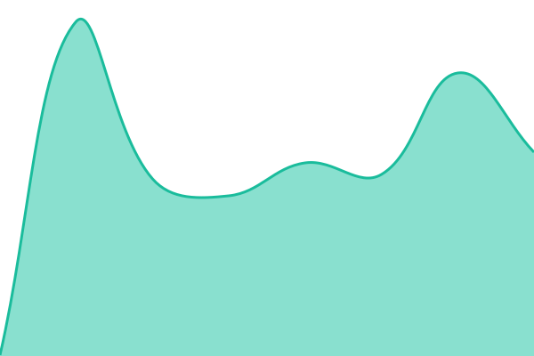
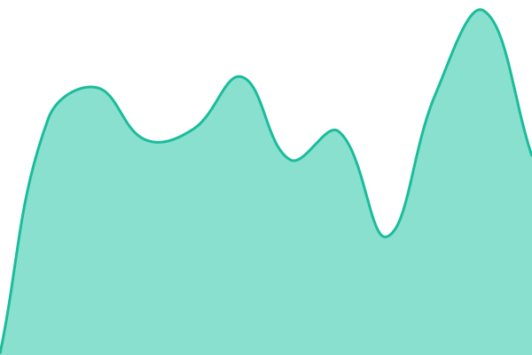
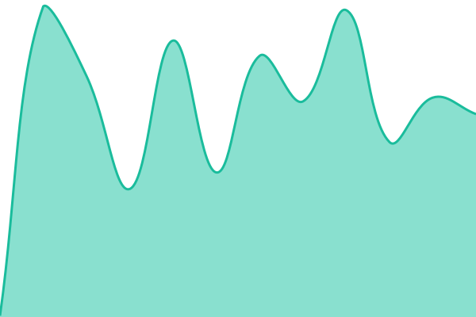
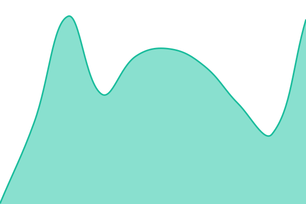
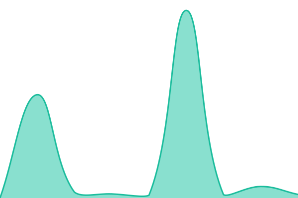

# [📈 Live Status](https://agio-digital.github.io/agio-status): <!--live status--> **🟩 All systems operational**

This repository contains the open-source uptime monitor and status page for [Agio Digital Ltd.](https://www.agiodigital.com), powered by [Upptime](https://github.com/upptime/upptime).

With [Upptime](https://upptime.js.org), you can get your own unlimited and free uptime monitor and status page, powered entirely by a GitHub repository. We use [Issues](https://github.com/agio-digital/agio-status/issues) as incident reports, [Actions](https://github.com/agio-digital/agio-status/actions) as uptime monitors, and [Pages](https://agio-digital.github.io/agio-status) for the status page.

<!--start: status pages-->
<!-- This summary is generated by Upptime (https://github.com/upptime/upptime) -->
<!-- Do not edit this manually, your changes will be overwritten -->
<!-- prettier-ignore -->
| URL | Status | History | Response Time | Uptime |
| --- | ------ | ------- | ------------- | ------ |
|  [Website](https://www.agiodigital.com/) | 🟩 Up | [website.yml](https://github.com/agio-digital/agio-status/commits/HEAD/history/website.yml) | 

 235ms
     
 | 

<a href="https://status.agiodigital.com/history/website">100.00%</a>
    

|  [Public API](https://api.agiodigital.com/) | 🟩 Up | [api.yml](https://github.com/agio-digital/agio-status/commits/HEAD/history/api.yml) | 

 207ms
     
 | 

<a href="https://status.agiodigital.com/history/api">100.00%</a>
    

|  [AI Agents](https://ai.agiodigital.com/livez) | 🟩 Up | [ai.yml](https://github.com/agio-digital/agio-status/commits/HEAD/history/ai.yml) | 

 174ms
     
 | 

<a href="https://status.agiodigital.com/history/ai">100.00%</a>
    

|  [GraphQL API](https://hasura.agiodigital.com/v1/version) | 🟩 Up | [graphql.yml](https://github.com/agio-digital/agio-status/commits/HEAD/history/graphql.yml) | 

 267ms
     
 | 

<a href="https://status.agiodigital.com/history/graphql">100.00%</a>
    

|  [Developer Documentation](https://docs.agiodigital.com/) | 🟩 Up | [docs.yml](https://github.com/agio-digital/agio-status/commits/HEAD/history/docs.yml) | 

 183ms
     
 | 

<a href="https://status.agiodigital.com/history/docs">100.00%</a>
    

|  [PDF Generation](https://agio-pdf-service-production-l2gf67l7ta-uc.a.run.app/health) | 🟩 Up | [pdf.yml](https://github.com/agio-digital/agio-status/commits/HEAD/history/pdf.yml) | 

 2452ms
     
 | 

<a href="https://status.agiodigital.com/history/pdf">100.00%</a>
    

<!--end: status pages-->

[**Visit our status website →**](https://agio-digital.github.io/agio-status)

## 📄 License

- Powered by: [Upptime](https://github.com/upptime/upptime)
- Code: [MIT](./LICENSE) © [Anand Chowdhary](https://anandchowdhary.com)
- Data in the `./history` directory: [Open Database License](https://opendatacommons.org/licenses/odbl/1-0/)
